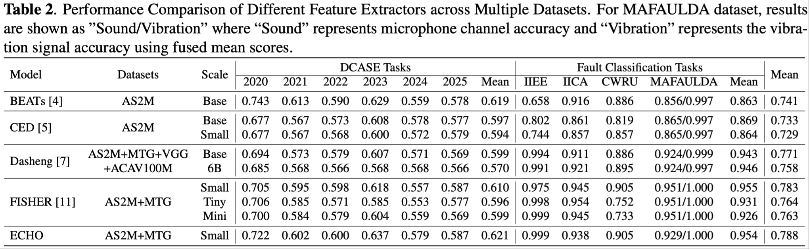

# SIREN

[](https://opensource.org/licenses/MIT)
[](https://www.python.org/downloads/)

SIREN (**SIgnal Representation Evaluation for machiNes**) is a unified evaluation toolkit for general machine signals. It supports both DCASE-style anomaly detection (Task 2, 2020–2025) and fault diagnosis/classification across common rotating machinery datasets. Plug in your own feature extractor once, and evaluate across tasks and datasets with multiprocessing, GPU acceleration, and feature caching.

## 🔥 Updates
- [2025.09.15]
    - Fix data leaking when testing MAFAULDA dataset with `per_channel_knn` activated.
    - Update comparison table.
- [2025.08.29]
    - Fix bugs when testing CWRU dataset. 
    - Fix bugs when calling `--no_multiprocessing` in DCASE series evaluation. 
    - Add EAT models in examples.
    - Fix Dasheng example.

## 📊 Benchmark Content

SIREN provides comprehensive benchmarking capabilities across multiple domains:

### DCASE Challenge Series (2020-2025)
- **Task 2: Unsupervised Anomaly Detection**
- **Datasets**: Machine operating sounds (fans, pumps, valves, etc.)
- **Metrics**: AUC, pAUC with domain/section-aware grouping
- **Evaluation**: Development and evaluation sets with official-like scoring

### Fault Diagnosis & Classification
- **MAFAULDA**: Multi-fault bearing dataset with 8-channel vibration data
- **CWRU**: Case Western Reserve University bearing fault dataset
- **IIEE**: IDMT-ISA Electric Engine dataset with noise-robust evaluation
- **IICA**: IDMT-ISA Compressed Air dataset


## 📦 Installation

### Quick Install

```bash
# Clone the repository
git clone https://github.com/yucongzh/SIREN.git
cd siren

# Install in development mode
pip install -e .
```

## 🎯 Quick Start

### 1) Implement Your Feature Extractor

```python
from siren import BaseFeatureExtractor
import torch

class MyExtractor(BaseFeatureExtractor):
    def __init__(self):
        super().__init__()
        self._feature_dim = 384  # single-channel base dim (or implement dynamic logic)
    
    def _extract_single_channel_features(self, signal_tensor: torch.Tensor, sample_rate: int) -> torch.Tensor:
        # signal_tensor: [1, samples]
        # Return a 1D feature vector: [feature_dim]
        return torch.mean(signal_tensor, dim=1)  # dummy example
    
    def _get_single_channel_feature_dim(self) -> int:
        return self._feature_dim
```

The base class handles:
- Loading and normalizing signals across formats (.wav/.csv/.mat)
- Multi-channel strategies: concatenate, mean, first, last
- Batch extraction convenience via `extract_features_batch`

See working examples in `examples/`:
- `echo_extractor.py`, `fisher_extractor.py`, `melspec_extractor.py`, `beats_extractor.py`
- `ced_extractor.py`, `dasheng_extractor.py`, `eat_extractor.py`

### 2) DCASE Anomaly Detection

```python
from siren import DCASETester

tester = DCASETester(
    dataset_root="data/machine_data",
    year=2020,                         # 2020–2025 or "all"
    extractor_path="my_extractor.py", # must define FeatureExtractor class
    multiprocessing_enabled=True,
    cache_enabled=True,
    cache_dir="feature_cache"
)
tester.run_evaluation()
```

CLI (Recommended)

```bash
# Evaluate one year
python evaluate_dcase.py --extractor_path examples/melspec_extractor.py --dcase_year 2023

# Evaluate all years sequentially
python evaluate_dcase.py --extractor_path examples/melspec_extractor.py --dcase_year all

# Evaluate all years without multiprocessing
python evaluate_dcase.py --extractor_path examples/melspec_extractor.py --dcase_year all --no_multiprocessing
```

Multi-GPU (one year per GPU)

```bash
bash run_all_dcase.sh examples/melspec_extractor.py
```

### 3) Fault Diagnosis / Classification

Python API (KNN-based embedding evaluation with k-fold or LOOCV)

```python
from siren import FaultClassificationTester
from examples.melspec_extractor import FeatureExtractor as MelSpecExtractor

feature_extractor = MelSpecExtractor()
config = {
    "dataset_root": "/path/to/dataset",
    "dataset_type": "mafaulda",    # "mafaulda", "cwru", "iiee", or "iica"
    "feature_extractor": feature_extractor,
    "extractor_name": "melspec_extractor",
    "k": 5,
    "metric": "euclidean",
    "use_kfold": True,              # set False to use train-test split
    "n_splits": 5,
    "use_loocv": False,             # set True to run LOOCV
    "return_per_channel_knn": False
}
tester = FaultClassificationTester(config)
results = tester.run_evaluation()
```

CLI (Recommended)

```bash
# MAFAULDA example
python test_fault_classification.py \
    --dataset_root /path/to/MAFAULDA \
    --extractor_name ${your_extractor_name}_extractor \
    --dataset_type mafaulda \
    --loocv --per_channel_knn

# CWRU example
python test_fault_classification.py \
    --dataset_root /path/to/CWRU_Bearing_Dataset/CWRU-dataset \
    --extractor_name ${your_extractor_name}_extractor \
    --dataset_type cwru \
    --loocv

# IIEE (IDMT-ISA Electric Engine) example
python test_fault_classification.py \
    --dataset_root /path/to/IDMT-ISA-Electric-Engine \
    --extractor_name ${your_extractor_name}_extractor \
    --dataset_type iiee \
    --no_kfold \
    --external_test --group_by_condition

# IICA (IDMT-ISA Compressed Air) example
python test_fault_classification.py \
    --dataset_root /path/to/IDMT-ISA-Compressed-Air \
    --extractor_name ${your_extractor_name}_extractor \
    --dataset_type iica \
    --use_kfold --n_splits 5
```

### 4) Quick Evaluation Commands

For comprehensive evaluation across all datasets and tasks, please use the provided script:

```bash
# Set your extractor name
export EXTRACTOR_NAME="your_extractor_name"

# Run comprehensive evaluation
bash quick_commands.sh $EXTRACTOR_NAME
```

This script will automatically:
1. Test DCASE series (2020-2025) sequentially
2. Test MAFAULDA dataset with LOOCV
3. Test CWRU dataset with LOOCV  
4. Test IIEE dataset with official train-test split
5. Test IICA dataset with k-fold cross-validation

## 📊 Results

Overall performance summary (DCASE anomaly detection + Fault classification):



## 📁 Dataset Structure

For detailed dataset organization instructions, please refer to [DATASET_STRUCTURE.md](DATASET_STRUCTURE.md).

**Supported Datasets:**
- **DCASE Challenge Series (2020-2025)**: Task 2 - Unsupervised Anomaly Detection
- **MAFAULDA**: Multi-fault bearing dataset with 8-channel vibration data
- **CWRU**: Case Western Reserve University bearing fault dataset  
- **IIEE**: IDMT-ISA Electric Engine dataset with noise-robust evaluation
- **IICA**: IDMT-ISA Compressed Air dataset

Each dataset has specific directory structure requirements. The detailed setup guide covers:
- Directory organization for each DCASE year
- Fault diagnosis dataset structures
- Evaluation label file formats
- Audio format and sample rate specifications

## 🤝 Contributing

**🚧 This toolkit is currently under active development!** 

We welcome contributions from the community to help make this toolkit more comprehensive and provide better benchmarks for machine signal anomaly detection/fault analysis. If you're interested in:

- **Adding new feature extractors** (audio, vibration, or other signal types)
- **Implementing new evaluation metrics** or datasets
- **Improving performance** or adding new features
- **Bug fixes** and documentation improvements
- **Research collaborations** on machine signal representation learning

Please feel free to:
- 🐛 Report issues on [GitHub Issues](https://github.com/yucongzh/SIREN/issues)
- 💡 Suggest new features or improvements
- 🔧 Submit pull requests
- 📧 Contact us directly at yucong0428@outlook.com

Together, we can build a more robust and comprehensive benchmark toolkit for the community!

 
## License

This project is licensed under the MIT License - see the [LICENSE](LICENSE) file for details.

## Acknowledgments
We borrow some codes from the officials from  DCASE Task 2 challenges
- [DCASE 2020 Task 2 Evaluator](https://github.com/y-kawagu/dcase2020_task2_evaluator)
- [DCASE 2021 Task 2 Evaluator](https://github.com/y-kawagu/dcase2021_task2_evaluator)
- [DCASE 2023 Task 2 Evaluator](https://github.com/nttcslab/dcase2023_task2_evaluator/)
- [DCASE 2024 Task 2 Evaluator](https://github.com/nttcslab/dcase2024_task2_evaluator)
- [DCASE 2025 Task 2 Evaluator](https://github.com/nttcslab/dcase2025_task2_evaluator)

## References

- DCASE Challenge Task 2 (2020–2025): see the official challenge pages at [dcase.community](https://dcase.community/challenge)
- CWRU Bearing Dataset: [Case Western Reserve University Bearing Data Center](https://engineering.case.edu/bearingdatacenter)
- [MAFAULDA](http://www02.smt.ufrj.br/~offshore/mfs/page_01.html) Bearing Fault Dataset: official dataset page/publication
- IDMT-ISA Electric Engine [(IIEE)](https://www.idmt.fraunhofer.de/en/publications/datasets/isa-electric-engine.html) and Compressed Air [(IICA)](https://www.idmt.fraunhofer.de/en/publications/datasets/isa-compressed-air.html) Datasets.


---

**⭐ Star this repository if you find it useful!** 
