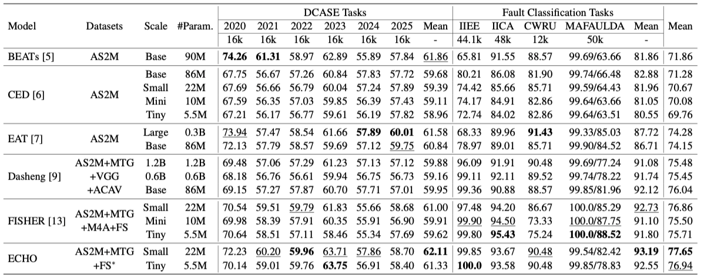

# SIREN

**Signal Representation Evaluation for Machines**

[](https://opensource.org/licenses/MIT)
[](https://www.python.org/downloads/)

SIREN is a unified evaluation toolkit for general machine signals. It supports both DCASE-style anomaly detection (Task 2, 2020–2025) and fault diagnosis/classification across common rotating machinery datasets. Plug in your own feature extractor once, and evaluate across tasks and datasets with multiprocessing, GPU acceleration, and feature caching.

## 🚀 Features

- ✅ **Multi-Task Support**
  - DCASE anomaly detection: 2020–2025 Task 2 with official-like grouping and AUC/pAUC
  - Fault diagnosis/classification: KNN-based pipeline with k-fold/LOOCV
- ✅ **Custom Feature Extractors**: One simple interface for all tasks and formats
- ✅ **Unified Signal I/O**: Load audio (.wav/.mp3/.flac/.m4a) and vibration (.csv/.mat) with a single API
- ✅ **Multiprocessing**: Significant speedup for large-scale runs
- ✅ **GPU Acceleration**: CUDA support for deep models
- ✅ **Feature Caching**: Avoid redundant extraction across runs and folds
- ✅ **Comprehensive Metrics**
  - DCASE: AUC, pAUC with domain/section-aware grouping
  - Classification: Accuracy, Precision, Recall, F1, per-class report, confusion matrix
- ✅ **CLI Interface**: Ready-to-run scripts for both tasks
- ✅ **Multi-GPU Support**: Parallel evaluation across GPUs (DCASE)
- ✅ **Unified Memory Banks**
  - DCASE 2021–2025: domain-aware structure (source/target)
  - Classification: multi-channel friendly KNN memory bank

## 📊 Benchmark Content

SIREN provides comprehensive benchmarking capabilities across multiple domains:

### DCASE Challenge Series (2020-2025)
- **Task 2: Unsupervised Anomaly Detection**
- **Datasets**: Machine operating sounds (fans, pumps, valves, etc.)
- **Metrics**: AUC, pAUC with domain/section-aware grouping
- **Evaluation**: Development and evaluation sets with official-like scoring

### Fault Diagnosis & Classification
- **MAFAULDA**: Multi-fault bearing dataset with 8-channel vibration data
- **CWRU**: Case Western Reserve University bearing fault dataset
- **IIEE**: IDMT-ISA Electric Engine dataset with noise-robust evaluation
- **IICA**: IDMT-ISA Compressed Air dataset

### Supported Models
- **ECHO**: Self-supervised audio representation learning
- **CED**: Conformer-based audio classification models
- **FISHER**: Frequency-aware self-supervised learning
- **BEATs**: Bootstrap Audio Representation Learning
- **Dasheng**: Large-scale audio foundation models
- **EAT**: Efficient Audio Transformer
- **Traditional**: Mel-spectrogram and statistical features

## 📦 Installation

### Quick Install

```bash
# Clone the repository
git clone https://github.com/yucongzh/SIREN.git
cd siren

# Install in development mode
pip install -e .
```

### With Conda (Recommended for GPU)

```bash
# Create environment
conda create -n siren python=3.8
conda activate siren

# Install PyTorch with CUDA
conda install pytorch torchaudio pytorch-cuda=11.8 -c pytorch -c nvidia

# Install package
pip install -e .
```

### Dependencies

```bash
# Core dependencies
pip install torch torchaudio numpy scipy scikit-learn pandas matplotlib seaborn

# Audio processing
pip install librosa soundfile

# Optional: Transformers for CED models
pip install transformers

# Optional: Fairseq for EAT models
pip install fairseq
```

## 🎯 Quick Start

### 1) Implement Your Feature Extractor

```python
from siren import BaseFeatureExtractor
import torch

class MyExtractor(BaseFeatureExtractor):
    def __init__(self):
        super().__init__()
        self._feature_dim = 384  # single-channel base dim (or implement dynamic logic)
    
    def _extract_single_channel_features(self, signal_tensor: torch.Tensor, sample_rate: int) -> torch.Tensor:
        # signal_tensor: [1, samples]
        # Return a 1D feature vector: [feature_dim]
        return torch.mean(signal_tensor, dim=1)  # dummy example
    
    def _get_single_channel_feature_dim(self) -> int:
        return self._feature_dim
```

The base class handles:
- Loading and normalizing signals across formats (.wav/.csv/.mat)
- Multi-channel strategies: concatenate, mean, first, last
- Batch extraction convenience via `extract_features_batch`

See working examples in `examples/`:
- `echo_extractor.py`, `fisher_extractor.py`, `melspec_extractor.py`, `beats_extractor.py`
- `ced_extractor.py`, `dasheng_extractor.py`

### 2) DCASE Anomaly Detection

```python
from siren import DCASETester

tester = DCASETester(
    dataset_root="data/machine_data",
    year=2020,                         # 2020–2025 or "all"
    extractor_path="my_extractor.py", # must define FeatureExtractor class
    multiprocessing_enabled=True,
    cache_enabled=True,
    cache_dir="feature_cache"
)
tester.run_evaluation()
```

CLI

```bash
# Evaluate one year
python evaluate_dcase.py --extractor_path examples/melspec_extractor.py --dcase_year 2023

# Evaluate all years sequentially
python evaluate_dcase.py --extractor_path examples/melspec_extractor.py --dcase_year all

# Evaluate all years with multiprocessing
python evaluate_dcase.py --extractor_path examples/melspec_extractor.py --dcase_year all --no_multiprocessing
```

Multi-GPU (one year per GPU)

```bash
bash run_all_dcase.sh examples/melspec_extractor.py
```

### 3) Fault Diagnosis / Classification

Python API (KNN-based evaluation with k-fold or LOOCV)

```python
from siren import FaultClassificationTester
from examples.melspec_extractor import FeatureExtractor as MelSpecExtractor

feature_extractor = MelSpecExtractor()
config = {
    "dataset_root": "/path/to/dataset",
    "dataset_type": "mafaulda",    # "mafaulda", "cwru", "iiee", or "iica"
    "feature_extractor": feature_extractor,
    "extractor_name": "melspec_extractor",
    "k": 5,
    "metric": "euclidean",
    "use_kfold": True,              # set False to use train-test split
    "n_splits": 5,
    "use_loocv": False,             # set True to run LOOCV
    "return_per_channel_knn": False
}
tester = FaultClassificationTester(config)
results = tester.run_evaluation()
```

CLI

```bash
# MAFAULDA example
python test_fault_classification.py \
  --dataset_root /path/to/MAFAULDA \
  --extractor_name examples.melspec_extractor \
  --dataset_type mafaulda \
  --use_kfold --n_splits 5

# CWRU example
python test_fault_classification.py \
  --dataset_root /path/to/CWRU \
  --extractor_name examples.melspec_extractor \
  --dataset_type cwru \
  --use_kfold --n_splits 5

# IIEE (IDMT-ISA Electric Engine) example
python test_fault_classification.py \
  --dataset_root /path/to/IDMT-ISA-Electric-Engine \
  --extractor_name examples.melspec_extractor \
  --dataset_type iiee \
  --use_kfold --n_splits 5

# IIEE external test (noise-robust task) with per-condition report
python test_fault_classification.py \
  --dataset_root /path/to/IDMT-ISA-Electric-Engine \
  --extractor_name examples.melspec_extractor \
  --dataset_type iiee \
  --external_test --group_by_condition

# IICA (IDMT-ISA Compressed Air) example
python test_fault_classification.py \
  --dataset_root /path/to/IDMT-ISA-Compressed-Air \
  --extractor_name examples.melspec_extractor \
  --dataset_type iica \
  --use_kfold --n_splits 5
```

### 4) Quick Evaluation Commands

For comprehensive evaluation across all datasets and tasks, use the provided script:

```bash
# Set your extractor name
export EXTRACTOR_NAME="your_extractor_name"

# Run comprehensive evaluation
bash quick_commands.sh $EXTRACTOR_NAME
```

This script will automatically:
1. Test DCASE series (2020-2025) sequentially
2. Test MAFAULDA dataset with LOOCV
3. Test CWRU dataset with LOOCV  
4. Test IIEE dataset with external test evaluation
5. Test IICA dataset with k-fold cross-validation

## 📊 Real Results

Overall performance summary (DCASE anomaly detection + Fault classification):



## 📁 Dataset Structure

Organize your datasets as follows (examples):

```
data/machine_data/
├── dcase2020_t2/
│   ├── development/
│   │   ├── fan/
│   │   │   ├── train/
│   │   │   └── test/
│   │   └── pump/
│   └── evaluation/
├── dcase2021_t2/
└── ...
```

MAFAULDA (example)

```
/path/to/MAFAULDA/
├── horizontal-misalignment/
│   ├── 0.5mm/
│   ├── 1.0mm/
│   ├── 1.5mm/
│   └── 2.0mm/
├── vertical-misalignment/
│   ├── 0.51mm/
│   ├── 0.63mm/
│   ├── 1.27mm/
│   ├── 1.40mm/
│   ├── 1.78mm/
│   └── 1.90mm/
├── imbalance/
│   ├── 6g/
│   ├── 10g/
│   ├── 15g/
│   ├── 20g/
│   ├── 25g/
│   ├── 30g/
│   └── 35g/
├── overhang/
│   ├── ball_fault/
│   ├── cage_fault/
│   └── outer_race/
├── underhang/
│   ├── ball_fault/
│   ├── cage_fault/
│   └── outer_race/
└── normal/
```

CWRU (example)

```
/path/to/CWRU/
├── 12k_Drive_End_Bearing_Fault_Data/
│   ├── B/
│   │   ├── 007/
│   │   ├── 014/
│   │   ├── 021/
│   │   └── 028/
│   ├── IR/
│   │   ├── 007/
│   │   ├── 014/
│   │   ├── 021/
│   │   └── 028/
│   └── OR/
│       ├── 007/
│       ├── 014/
│       └── 021/
├── 12k_Fan_End_Bearing_Fault_Data/
│   ├── B/
│   │   ├── 007/
│   │   ├── 014/
│   │   └── 021/
│   ├── IR/
│   │   ├── 007/
│   │   ├── 014/
│   │   └── 021/
│   └── OR/
│       ├── 007/
│       ├── 014/
│       └── 021/
├── 48k_Drive_End_Bearing_Fault_Data/
│   ├── B/
│   │   ├── 007/
│   │   ├── 014/
│   │   └── 021/
│   ├── IR/
│   │   ├── 007/
│   │   ├── 014/
│   │   └── 021/
│   └── OR/
│       ├── 007/
│       ├── 014/
│       └── 021/
└── Normal/
```

IIEE (IDMT-ISA Electric Engine) (example)

```
/path/to/IDMT-ISA-Electric-Engine/
├── train/
│   ├── engine1_good/pure.wav
│   ├── engine2_broken/pure.wav
│   └── engine3_heavyload/pure.wav
├── train_cut/
│   ├── engine1_good/pure_*.wav   # 3-second clips, 44.1 kHz, mono, 16-bit
│   ├── engine2_broken/pure_*.wav
│   └── engine3_heavyload/pure_*.wav
└── test/
    ├── engine1_good/{talking_*.wav, atmo_*.wav, whitenoise_low.wav, stresstest.wav}
    ├── engine2_broken/{...}
    └── engine3_heavyload/{...}
```

IICA (IDMT-ISA Compressed Air) (example)

```
/path/to/IDMT-ISA-Compressed-Air/
└── raw/
    ├── tubeleak/{hydr, hydr_low, lab, work, work_low}/{1,2,3}/*.wav  # 48 kHz, mono, 24-bit
    └── ventleak/{hydr, hydr_low, lab, work, work_low}/{1,2,3}/*.wav
```

## 📈 Performance

- **6x speedup** with multiprocessing
- **GPU acceleration** for deep learning models
- **Feature caching** for faster re-evaluation
- **Memory efficient** processing

## 🔧 Configuration

### Memory Bank Settings

```python
config = {
    'memory_bank': {
        'similarity_type': 'cosine',  # 'cosine' or 'euclidean'
        'aggregation': 'max',         # 'max', 'mean', 'min', 'knn'
        'k': 1,                       # For KNN aggregation
        'domain_strategy': 'min',     # 'min', 'max', 'mean' (DCASE 2021-2025)
        'enable_kmeans_optimization': False,  # Enable kmeans clustering
        'kmeans_threshold': 100,      # Sample threshold for kmeans
        'kmeans_n_clusters': 16       # Number of kmeans clusters
    }
}
```

### Multiprocessing Settings

```python
config = {
    'multiprocessing': {
        'enabled': True,
        'num_processes': 6  # Number of parallel processes
    }
}
```

## 🔄 New Features (DCASE 2021-2025)

### Unified Memory Bank Structure

For DCASE 2021-2025, the memory bank uses a unified structure:

```python
memory_bank = {
    'section_00': {
        'source': features,  # Source domain features
        'target': features   # Target domain features
    },
    'section_01': {
        'source': features,
        'target': features
    },
    ...
}
```

### Domain-Aware Anomaly Scoring

The framework now supports domain-aware anomaly scoring:

1. **Separate Computation**: Source and target features are processed separately
2. **Strategy Selection**: Choose how to combine scores ('min', 'max', 'mean')
3. **KMeans Optimization**: Optional clustering for large feature sets

### Configuration Examples

```python
# Basic configuration (default)
config = {
    'memory_bank': {
        'domain_strategy': 'min',     # Use minimum of source/target scores
        'enable_kmeans_optimization': False
    }
}

# Advanced configuration with kmeans optimization
config = {
    'memory_bank': {
        'domain_strategy': 'mean',    # Use mean of source/target scores
        'enable_kmeans_optimization': True,
        'kmeans_threshold': 100,      # Enable for >100 samples
        'kmeans_n_clusters': 16       # Number of clusters
    }
}
```

## 📚 Documentation

- [Examples](examples/)
- [Quick Start](#-quick-start)

 

## 📄 License

This project is licensed under the MIT License - see the [LICENSE](LICENSE) file for details.

## 🙏 Acknowledgments
We borrow some codes from the officials from  DCASE Task 2 challenges
- [DCASE 2020 Task 2 Evaluator](https://github.com/y-kawagu/dcase2020_task2_evaluator)
- [DCASE 2021 Task 2 Evaluator](https://github.com/y-kawagu/dcase2021_task2_evaluator)
- [DCASE 2023 Task 2 Evaluator](https://github.com/nttcslab/dcase2023_task2_evaluator/)
- [DCASE 2024 Task 2 Evaluator](https://github.com/nttcslab/dcase2024_task2_evaluator)
- [DCASE 2025 Task 2 Evaluator](https://github.com/nttcslab/dcase2025_task2_evaluator)

## 📚 Dataset References

- DCASE Challenge Task 2 (2020–2025): see the official challenge pages at [dcase.community](https://dcase.community/challenge)
- CWRU Bearing Dataset: [Case Western Reserve University Bearing Data Center](https://engineering.case.edu/bearingdatacenter)
- [MAFAULDA](http://www02.smt.ufrj.br/~offshore/mfs/page_01.html) Bearing Fault Dataset: official dataset page/publication
- IDMT-ISA Electric Engine [(IIEE)](https://www.idmt.fraunhofer.de/en/publications/datasets/isa-electric-engine.html) and Compressed Air [(IICA)](https://www.idmt.fraunhofer.de/en/publications/datasets/isa-compressed-air.html) Datasets.

## 📞 Support

- 📧 Email: yucong0428@outlook.com
- 🐛 Issues: [GitHub Issues](https://github.com/yucongzh/SIREN/issues)
- 📖 Documentation: [Examples](examples/)

---

**⭐ Star this repository if you find it useful!** 